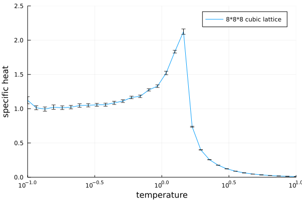
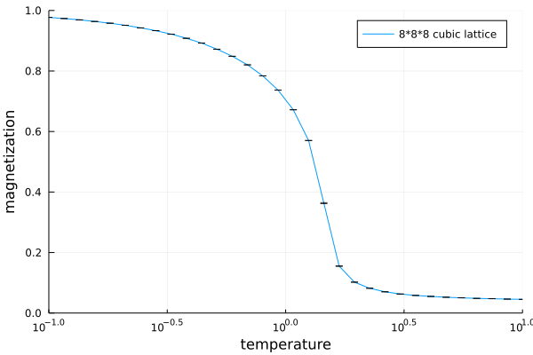
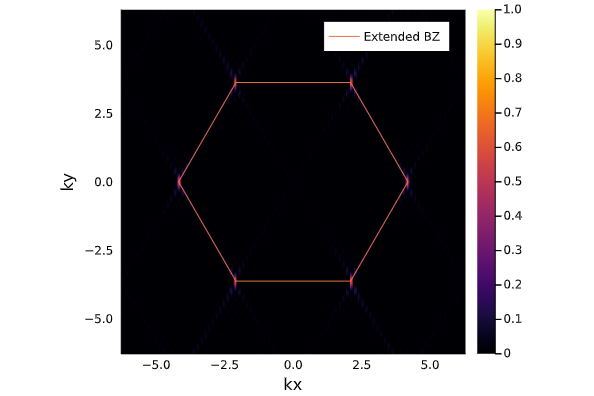

The package SpinMC.jl provides a flexible Markov chain Monte Carlo implementation for classical lattice spin models. 
It is suitable to simulate microscopic spin models which are described by a Hamiltonian of the form 


Throughout the simulation, measurements of the energy density, the specific heat, the absolute value of the magnetization, and the spin correlations are performed. 
The statistical evaluation of measurements is based on the [BinningAnalysis.jl](https://github.com/crstnbr/BinningAnalysis.jl) package.

The model Hamiltonian of classical O(3) spins can be defined on arbitrary D-dimensional lattices, whose efficient representation is automatically constructed from a customizable lattice unit cell, employing periodic boundary conditions. 

The implementation further leverages [MPI](https://github.com/JuliaParallel/MPI.jl) to enable the parallel simulation of multiple replicas of the original system at different temperatures in the spirit of the [parallel tempering](https://arxiv.org/abs/cond-mat/9512035) algorithm, thereby allowing for much faster convergence of the results. 

The SpinMC.jl package can be installed by invoking the following command in the Julia REPL:
```julia
] add https://github.com/fbuessen/SpinMC.jl
```

## Define a lattice spin model
We illustrate the setup of a two-dimensional honeycomb lattice with antiferromagnetic nearest-neighbor Heisenberg interactions. 

```julia
using SpinMC

# Create the lattice unit cell from the primitive lattice vectors a1 and a2.
a1 = (3/2, sqrt(3)/2)
a2 = (3/2, -sqrt(3)/2)
uc = UnitCell(a1,a2) 

# Add two basis sites to the unit cell at positions (0,0) and (1,0), respectively. 
b1 = addBasisSite!(uc, (0.0, 0.0))
b2 = addBasisSite!(uc, (1.0, 0.0)) 

# Add antiferromagnetic Heisenberg interactions between nearest neighbors.
M = [1.0 0.0 0.0; 0.0 1.0 0.0; 0.0 0.0 1.0] # Heisenberg interaction matrix
addInteraction!(uc, b1, b2, M, (0, 0)) # Interaction of basis site b1 with site b2 in the same unit cell
addInteraction!(uc, b1, b2, M, (-1, 0)) # Interaction of basis site b1 with site b2 in the unit cell shifted by (-1, 0) lattice vectors.
addInteraction!(uc, b1, b2, M, (0, -1)) # Interaction of basis site b1 with site b2 in the unit cell shifted by (0, -1) lattice vectors.
#setField!(uc, b1, [1.0, 1.0, 1.0]) # Optionally apply a magnetic field B=(1,1,1) to basis site b1. 

# Generate a lattice of 16*16 unit cells. 
L = (16, 16)
lattice = Lattice(uc, L)
```
Note that the interactions, which are added to the unit cell by means of the `addInteraction!` function are directed from basis site `b1` to basis site `b2`. It is thus straight-forward to implement e.g. antisymmetric [Dzyaloshinskii–Moriya](https://en.wikipedia.org/wiki/Antisymmetric_exchange) interactions. 
Similarly, since the interactions are defined individually for every pair of lattice sites, it is readily possible to implement e.g. bond-directional [Kitaev](https://arxiv.org/abs/cond-mat/0506438) exchange. 

## Launch a Monte Carlo simulation
With the lattice object created above, we are now ready to launch the Monte Carlo simulation. 

```julia
# Define simulation parameters
thermalizationSweeps = 50000 # Number of sweeps to thermalize the system. 
measurementSweeps = 50000 # Number of sweeps after thermalization to perform measurements.
beta = 10.0 #inverse temperature

# Create and run simulation
m = MonteCarlo(lattice, beta, thermalizationSweeps, measurementSweeps)
run!(m, outfile="simulation.h5") # Run simulation and write result file "simulation.h5". 
```

The MonteCarlo constructor further accepts the following kwargs:
* `measurementRate`: After thermalization, perform measurements at the specified rate, in units of sweeps (default: 1). 
* `reportInterval`: Rate at which to print progress to the terminal, in units of sweeps (default: 1/20 of the total number of sweeps). 
* `checkpointInterval`: Interval at which to write checkpoints to disk, in units of seconds (default: 3600). 
* `rng`: Random number generator to use (default: copy of Random.GLOBAL_RNG).
* `seed`: Seed for the random number generator (default: Random.RandomDevice()). 
* `replicaExchangeRate`: Rate at which to attempt replica exchanges in MPI mode (default: 10), see below. 

The code example above would write progress reports to the terminal, similar to the following: 
```text
Simulation started on 02 Apr 2021 19:57:11.

Sweep 5000 / 100000 (5.0%)              ETA : 02 Apr 2021 19:57:14
                thermalized : NO
                sweep rate : 37878.8 sweeps/s
                sweep duration : 0.026 ms
                update acceptance rate: 3.59%

Sweep 10000 / 100000 (10.0%)            ETA : 02 Apr 2021 19:57:13
                thermalized : NO
                sweep rate : 52631.6 sweeps/s
                sweep duration : 0.019 ms
                update acceptance rate: 3.50%

[...]
```

## Launch multiple replicas of Monte Carlo simulations in MPI mode
Alternatively, the Monte Carlo simulation can be launched in an MPI environment by executing Julia with the usual `mpirun` command. 
When run in an MPI environment, i.e. `MPI.Init()` has been called prior to invoking the `run!()` command, the Monte Carlo simulation automatically performs replica exchanges of spin configurations between the simulations running on different MPI ranks. 

```julia
# Initialize MPI
using MPI
MPI.Initialized() || MPI.Init()
commSize = MPI.Comm_size(MPI.COMM_WORLD)
commRank = MPI.Comm_rank(MPI.COMM_WORLD)

# Define simulation parameters
thermalizationSweeps = 50000
measurementSweeps = 50000
tmin = 0.1
tmax = 10.0
beta = (commSize == 1) ? 1.0/tmin : 1.0 / (reverse([ tmax * (tmin / tmax)^(n/(commSize-1)) for n in 0:commSize-1 ])[commRank+1]) # Assign logarithmically spaced temperature points across the different MPI ranks

# Create and run simulation
m = MonteCarlo(lattice, beta, thermalizationSweeps, measurementSweeps, replicaExchangeRate=10) # Attempt replica exchanges every 10 sweeps
run!(m, outfile="simulation.h5") # In MPI mode, each rank creates a separate result file "simulation.h5.RANK"
```

The code example above would produce terminal output similar to the following: 
```text
Simulation started on 02 Apr 2021 20:00:44.

Sweep 5000 / 100000 (5.0%)              ETA : 02 Apr 2021 20:00:47
                thermalized : NO
                sweep rate : 33333.3 sweeps/s
                sweep duration : 0.030 ms
                simulation 0 update acceptance rate: 89.18%
                simulation 0 replica exchange acceptance rate : 65.60%
                simulation 1 update acceptance rate: 91.44%
                simulation 1 replica exchange acceptance rate : 67.20%
                simulation 2 update acceptance rate: 93.19%
                simulation 2 replica exchange acceptance rate : 73.60%
                simulation 3 update acceptance rate: 94.59%
                simulation 3 replica exchange acceptance rate : 78.40%

[...]
```

## Continue or extend a simulation
The simulation periodically writes checkpoint files to save the progress. 
If a simulation crashes, it can be resumed from the last checkpoint. 
Similarly, the checkpoint of a completed simulation can be read, and the number of measurement sweeps extended to further improve the result. 

```julia
# Load MonteCarlo object from checkpoint file
m = readMonteCarlo("simulation.h5") 

#m.measurementSweeps = 100000 # If desired, increase the total number of sweeps to perform. 

# Resume calculation
run!(m, outfile="simulation.continued.h5") 
```

## Access results
The output file, which is generated by the `run!` command, contains both binary checkpoint data and human readable measurement results. 
It is written in the [HDF5](https://github.com/JuliaIO/HDF5.jl) file format, with the measurement results found in the following locations: 
* `mc/observables/energyDensity/mean`, `mc/observables/energyDensity/error`: Mean value and standard error of the energy density. 
* `mc/observables/magnetization/mean`, `mc/observables/magnetization/error`: Mean value and standard error of the absolute value of the magnetization per lattice site. 
* `mc/observables/correlation/mean`, `mc/observables/correlation/error`: Mean value and standard error of the spin correlations relative to a fixed reference site (the first lattice site).
* `mc/observables/specificHeat/mean`, `mc/observables/specificHeat/error`: Mean value and standard error of the specific heat capacity per spin. 

Alternatively, after running a simulation, the results can be accessed interactively in the `m.observables.energy` (containing the energy density and its square value), `m.observables.magnetization`, and `m.observables.correlation` data structures, which are of types `ErrorPropagator` and `LogBinner`, respectively, as defined in the [BinningAnalysis.jl](https://github.com/crstnbr/BinningAnalysis.jl) package. 

## Examples

### Specific heat and magnetization of a cubic lattice Heisenberg ferromagnet
Below, we provide a complete example to calculate the specific heat and magnetization of a Heisenberg ferromagnet on the cubic lattice as a function of temperature. For illustrative purposes, we calculate the different temperature points sequentially, instead of making use of the built-in MPI support for parallel simulations. 

```julia
using SpinMC

a1 = (1.0, 0.0, 0.0)
a2 = (0.0, 1.0, 0.0)
a3 = (0.0, 0.0, 1.0)
uc = UnitCell(a1,a2,a3)

b = addBasisSite!(uc, (0.0, 0.0, 0.0))
M = [-1.0 0.0 0.0; 0.0 -1.0 0.0; 0.0 0.0 -1.0]
addInteraction!(uc, b, b, M, (1, 0, 0))
addInteraction!(uc, b, b, M, (0, 1, 0))
addInteraction!(uc, b, b, M, (0, 0, 1))

L = (8, 8, 8)
lattice = Lattice(uc, L)
thermalizationSweeps = 10000
measurementSweeps = 100000

tmin = 0.1
tmax = 10.0
N = 32
temperature = zeros(N)
heat = zeros(N)
dheat = zeros(N)
magnetization = zeros(N)
dmagnetization = zeros(N)
for i in 1:N
    println("Performing MC simulation ", i, "/", N)
    beta = 1.0 / (tmax * (tmin / tmax)^((i-1)/(N-1)))
    m = MonteCarlo(lattice, beta, thermalizationSweeps, measurementSweeps, reportInterval=20000)
    run!(m)
    temperature[i] = 1.0 / beta

    # Calculate specific heat 
    # (Note that if file output is activated in the run!() call, the specific heat is automatically included.)
    c(e) = beta * beta * (e[2] - e[1] * e[1]) * length(m.lattice)
    ∇c(e) = [-2.0 * beta * beta * e[1] * length(m.lattice), beta * beta * length(m.lattice)]
    heat[i] = mean(m.observables.energy, c)
    dheat[i] = std_error(m.observables.energy, ∇c)
    # Calculate magnetization
    magnetization[i] = mean(m.observables.magnetization)
    dmagnetization[i] = std_error(m.observables.magnetization)
end

using Plots
display(plot(temperature, heat, yerror=dheat, xaxis=:log, yrange=(0.0,2.5), xrange=(0.1,10.0), xlabel="temperature", ylabel="specific heat", label="8*8*8 cubic lattice"))
display(plot(temperature, magnetization, yerror=dmagnetization, xaxis=:log, yrange=(0.0,1.0), xrange=(0.1,10.0), xlabel="temperature", ylabel="magnetization", label="8*8*8 cubic lattice"))
```



### Spin structure factor of a honeycomb lattice Heisenberg antiferromagnet
As a second example, we compute the ground state of the Heisenberg antiferromagnet on the honeycomb lattice. 
The model is expected to host Neel order in the ground state, i.e. the spins on the two sublattices of the bipartite honeycomb lattice are aligned antiparallel. 

Long-range Neel order implies sharp peaks in the magnetic structure factor (i.e. the Fourier transformed spin correlations) on the corners of the extended Brillouin zone. 
Note that due to the finite system size with periodic boundary conditions, only a finite set of points formally exists in momentum space. We'll ignore this for simplicity. 

```julia
using SpinMC
using LinearAlgebra

a1 = (3/2, sqrt(3)/2)
a2 = (3/2, -sqrt(3)/2)
uc = UnitCell(a1,a2)

b1 = addBasisSite!(uc, (0.0, 0.0))
b2 = addBasisSite!(uc, (1.0, 0.0))

M = [1.0 0.0 0.0; 0.0 1.0 0.0; 0.0 0.0 1.0]
addInteraction!(uc, b1, b2, M, (0, 0))
addInteraction!(uc, b1, b2, M, (0, -1))
addInteraction!(uc, b1, b2, M, (-1, 0))

L = (16, 16)
lattice = Lattice(uc, L)

thermalizationSweeps = 50000
measurementSweeps = 50000
beta = 10.0
m = MonteCarlo(lattice, beta, thermalizationSweeps, measurementSweeps)
run!(m)

# Fourier transform correlations to compute structure factor. 
N = 256
correlation = mean(m.observables.correlation) # The correlation is measured with respect to the first spin, i.e. the i-th entry is the correlation dot(S_1,S_i). 
kx = collect(range(-2pi,2pi,length=N))
ky = collect(range(-2pi,2pi,length=N))
structurefactor = zeros(N,N)
for i in 1:N
    for j in 1:N
        z = 0.0
        # Compute Fourier transformation at momentum (kx, ky). The real-space position of the i-th spin is obtained via getSitePosition(lattice,i). 
        for k in 1:length(lattice)
            z += cos(dot((kx[i],ky[j]),getSitePosition(lattice,k))) * correlation[k]
        end
        structurefactor[i,j] = z / length(lattice)
    end
end

# Plot result
using Plots
heatmap(kx,ky,structurefactor,aspect_ratio=1,xrange=(-2pi,2pi),yrange=(-2pi,2pi),clims=(0,1),xlabel="kx", ylabel="ky")
xs = [0.0, 2.0pi/sqrt(3.0), 2.0pi/sqrt(3.0), 0.0, -2.0pi/sqrt(3.0), -2.0pi/sqrt(3.0), 0.0]
ys = [4.0pi/3.0, 2.0pi/3.0, -2.0pi/3.0, -4.0pi/3.0, -2.0pi/3.0, 2.0pi/3.0, 4.0pi/3.0]
plot!(xs, ys, label="Extended BZ")
```

